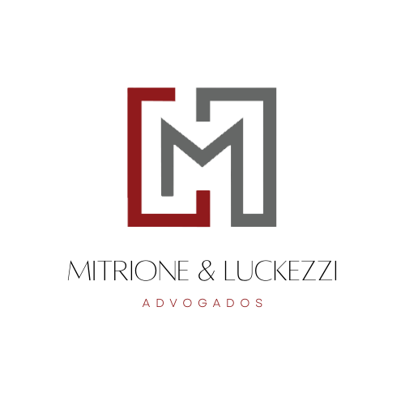

<p align="center">
  

<h1 align="center">
    
</h1>

<br>

## 🧪 Tecnologias

Esse projeto foi desenvolvido com as seguintes tecnologias:

- [Next.js](https://nextjs.org/)
- [Chakra-UI](https://chakra-ui.com/)
- [React-icons](https://react-icons.github.io/react-icons/)
- [React Hook Form](https://react-hook-form.com/)
- [Yup](https://github.com/jquense/yup)


## 🚀 Como executar

Clone o projeto e acesse a pasta do mesmo.

```bash
$ git clone https://github.com/gabrielgws/mitrione-luckezzi-advogados.git
$ cd mitrione-luckezzi-advogados
```

Para iniciá-lo, siga os passos abaixo:
```bash
# Instalar as dependências
$ yarn

# Iniciar o projeto
$ yarn dev
```
O app estará disponível no seu browser pelo endereço http://localhost:3000.

## 💻 Projeto

Desenvolvimento de uma Landing page para um advogado. Serviço Freelancer.

## 🔖 Layout

Direitos gabrielgws.com

## 📝 License

---

Feito com 💜 by gabrielgws :rocket:	
